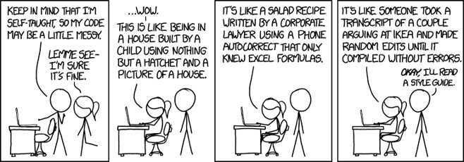

Life has tons of rules. Before practicing a rule, you need to see why it is worth your attention. 

## Are coding standards attention-worthy?

Coding standards are important because they teach programmers how to code. Just as book authors indent once at the beginning of every paragraph, add quotation marks around a citation, or avoid repeating the same words or phrases, coders also follow a set of rules. 

The Software Engineering course I am taking advised us to install ESLint, a tool that checks code quality. Here is an example of ESLint in action (view the red suggestions). 

*A developer using ESLint to reduce bugs and strengthen code clairty*

As you can see, there is a lot to fix in this program. The developer needs to fix their variable declarations, change the types of quotes they are using, and remove repeated elements. Error checking extensions like ESLint may come off as a strict professor who never ceases to find mistakes in your essay. These red suggestions might seem like a hassle, but once you correct them, your code improves and the errors go away. 

## Are there any benefits to adopting code standards?

I think error checkers are helpful. It keeps the code style consistent. This enhances the readability of code so that you or anyone that looks at your code can understand what is going on. 

I would say adding comments to your code is the best way to be certain of your comprehension. Most workplaces utilize header comments, which are placed right before a function to explain what it does. Comments too, contribute to a good coding style.

If more than one developer is working on a single project, how can we guarantee consistency? Coding style! 

New developers read any provided documentation about the project. However, they also read and test out the code themselves. Understanding how functions interact and contribute to the larger project is hard enough. Not keeping the same syntax and style makes it more difficult. It is like reading a book that changes word choice about a quarter of the way through. It is readable but will take a longer time and greater effort to understand it. 

Moreover, varying styling may increase the chances of bugs, which are unintended errors, in the code. 

So, to make things easier for all of us, we can commit a few moments of time to conforming to a specified code style. Looking toward the future, it is helpful to us and our team so why not put some extra effort into improving our styling skills? 

 Note: This essay was reviewed by ChatGPT for structure and grammar corrections.

