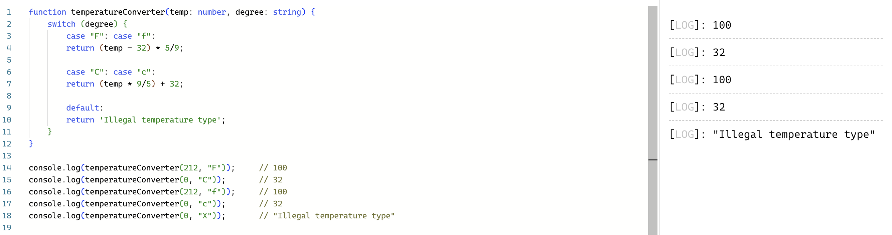

I am new to Typescript, having primarily worked with languages like Java and C. As I begin to explore its features, I am excited to see how Typescript builds on Javascript’s features like typing, syntax, and debugging. Compared to Java, TypeScript feels more flexible, especially since it allows optional types. 

### Thoughts on Typescript
In my ICS 314: Software Engineering class, we have regular practice Workouts of the Day (WODs). Here is one of the WODs we worked on in groups recently. Imagine my surprise when I realized I did not need to add a return type for this function below. In C and Java, I always specified a return type. The flexibility of Typescript is intriguing, which leads me to believe it is a good language. I just need more practice with it. 

  

### How is Typescript different from other programming langugues I know?
I need to get used to the syntax of TypeScript, especially in how variables and parameters are declared. For example, in TypeScript, I declare a variable with a syntax like this: `variableName: type`, which differs from what I’m used to in languages like Java and C. In those languages, I typically declare variables using `type variableName`. In TypeScript, using `let` and `const` for variable declarations is intuitive. If we want to reassign the value of a variable, we declare it using `let`. If we want the value to stay constant, we use `const`. Though this syntax feels a little unfamiliar, I know dedicating time to getting comfortable with Typescript will solve that. 

### The purpose of the WODs
As a beginner, it is easy to read tutorials and follow along with basic examples, but the real test comes when I have to solve problems. The WODs are designed to test our coding skills. At first, I thought they were stressful. However, I see now they are a great opportunity to test our problem-solving skills. While we might not be working under a time crunch in the real world, familiarizing ourselves with common problem patterns helps us become more efficient programmers. 

**return type: indicates the kind of data the function returns (e.g., string or number)**
