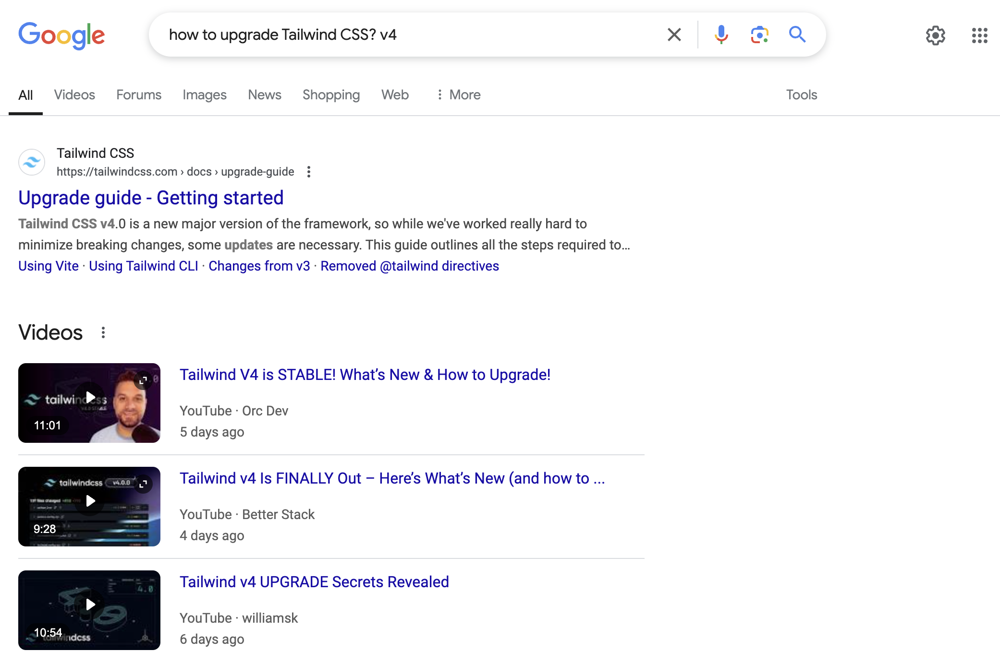

<div style="text-align: center;">
    
    <p style="font-style: italic;">Welcome to the Stack Exchange, a collection of questions and answers sites on a variety of subjects.</p>
</div>

[Stack Overflow](https://stackoverflow.com/) is the go-to site for all programming questions. Seeking help on a coding problem that you cannot seem to wrap your head around? Well then, Stack Overflow is the place for you!

Before you venture off to Stack Overflow, we should go over the formalities of using online forums with some real examples! Here I have sourced a smart question and not-so-smart question from the site itself. 

## Outstanding question!

First up is the [smart question](https://stackoverflow.com/questions/79380519/how-to-upgrade-tailwindcss) I chose: "How to upgrade Tailwindcss." The developer uses a clear title, shares a link to his project repository, states his problem, the exact error he is receiving, and how he tried to solve the issue. In addition, he tagged his post with related keywords: ```angular``` and ```tailwind-css```. To top it off, he gave thanks in advance. Looking just at Stack Overflow, I would say this is an exemplary post. 

## There's a tutorial for that? 

Eric S. Raymond is the author of “How To Ask Questions The Smart Way,” an [online tutorial](http://www.catb.org/esr/faqs/smart-questions.html) on asking questions that get helpful responses. Raymond suggests that before asking a question on Stack Overflow, you should search for an answer on the Web. Here is a similar question I searched on Google. 

<div class="text-center p-4">
  
</div>
<p style="text-align:center; font-style:italic;">
  Searching up "how to upgrade Tailwind CSS? v4" in Google on Jan. 29, 2025
</p>

I can already see documentation from the official Tailwind CSS website and YouTube videos showing how to upgrade to Tailwind Version 4. Although the documentation does not have a date posted, the YouTube videos do. However, if you compare the date posted of the YouTube tutorials versus the Stack Overflow question, the Stack Overflow question was asked first. In other words, since the question was posed before any answers were available online, it is a smart question. 

## This question could use some improvement

The [non-smart question](https://stackoverflow.com/questions/68627208/how-to-read-the-first-letter-from-the-last-line-in-a-txt-file-in-python) I chose is titled: "How to read the first letter from the last line in a txt file in python." The asking developer uses one tag: ```python```. He acknowledges that his question is confusing but does not provide additional material to support his prompt (e.g., example output or code snippets). Thankfully, he received answers from multiple users, but in future posts, he should consider adding more information to receive quicker, accurate responses. 

## That's a wrap!
In conclusion, before asking a question, research it yourself. Explore: search the Web, read manuals, or ask a skilled friend. If you still do not know the answer, find an online forum related to your question. Programmers may be interested in these websites: Super User for computing questions, Server Fault for discussions on server and network administration, and Stack Overflow for programming-related concerns. In your post, use a clear title, describe your problem and your handling process (this prevents respondents from making similar mistakes), and be kind! Knowing how to phrase your questions clearly, respectfully, and in the right place is crucial for software engineers who are always learning new languages, programs, and skills.
