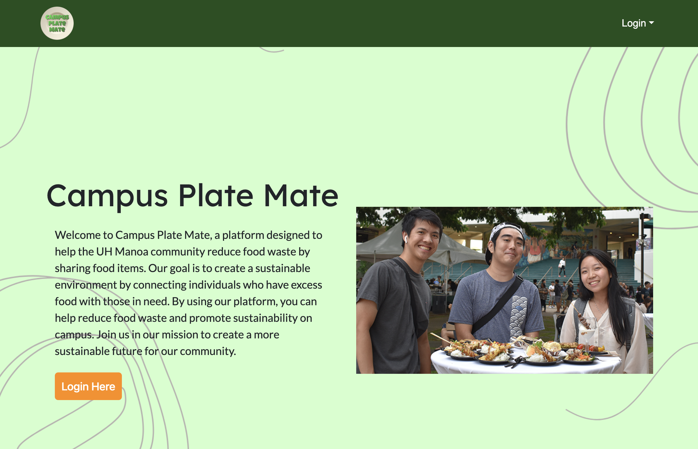

    

 

## The Purpose
Campus Plate Mate is an application that connects students and businesses with leftover food to students facing food insecurity and could benefit from receiving free or shareable food. I developed Campus Plate Mate along with my team: Kimi Li, Lou Rae Robles, Ka'ili Benavente, Naydel Espiritu, and Jaylin Morimoto.

After signing up, our site has four main pages for users:
- Dashboard: View food available to claim
- Add Food: Post food that you want to share or give away
- Profile: View your posts only
- Rewards: Available rewards to redeem points from logging in, posting, or claiming

We also have an admin-only page that displays submitted user feedback.

## My Role
My main responsibilities were creating the footer, the Rewards page, and updating the Admin page to show user feedback. The footer accepts user feedback and sends it to our PostgreSQL database. For the Admin page, it pulls each of those responses and displays it in a visually-appealing manner. I also added a date to each feedback, as some may be outdated if we already responded to it somehow. As for the Rewards page, it pulls rewards data from our database and lists all the rewards users could redeem their points for. You can click the "Redeem" button on any one of them and be directed to a checkout page then a confirmation page. I also made changes to the final look of the site, and detected and fixed some bugs.  

## Thoughts

I enjoyed working on this project. It gave me a deeper understanding of what it takes to create a web application. First, we brainstormed what project will be about, which included writing out the purpose of Campus Plate Mate and the uses of various pages, then, we created mockup pages, which were not functional but were an idea of what we want the site to look like, then we created databases, pulled information from our databases, all the while tweaking the look of our application. Sometimes we encountered errors or a challenging, new concept but my team successfully pushed forward. I am excited to use the skills I learned in future projects.

You can view our application repository [here.](https://github.com/campusplatemate/application)
