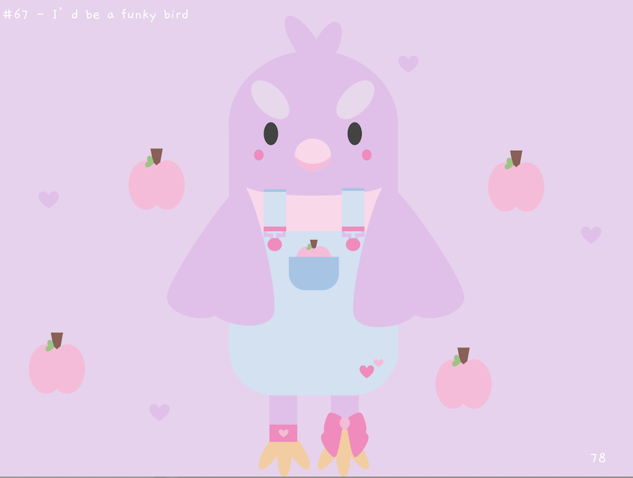
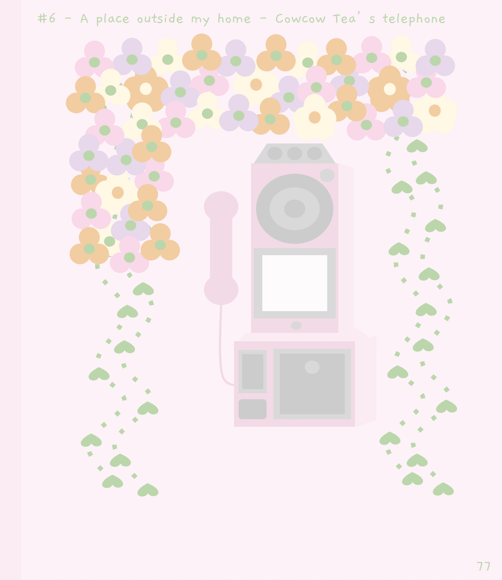
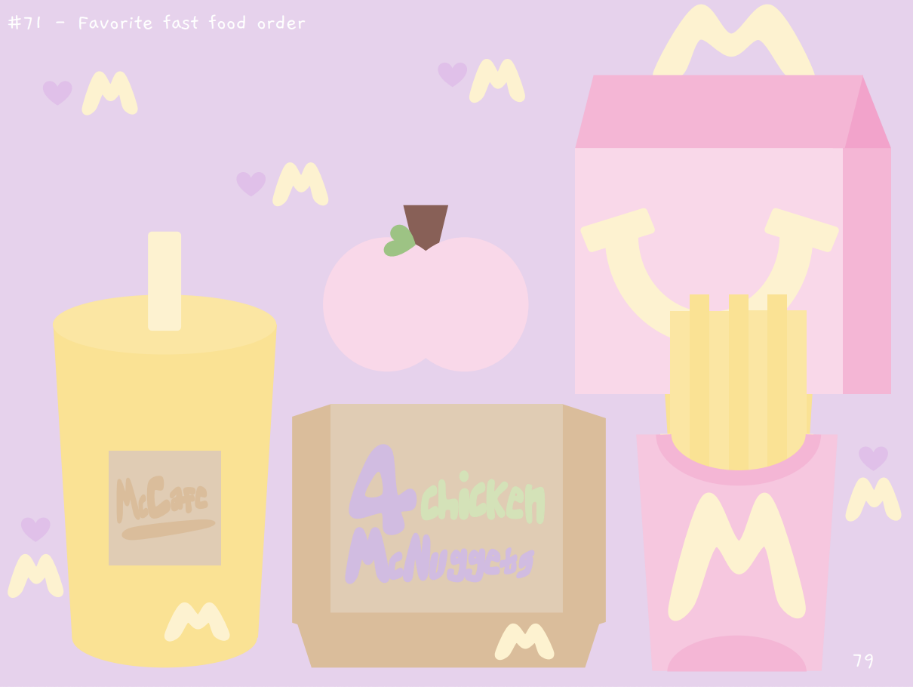

  
    
  

In my Ceramics class in high school, I was required to keep a notebook of illustrations. We used it to sketch projects, take notes, but also to draw based on a list of topics the teacher provided. For example, Topic #6 was a place outside my home so I chose to draw the telephone booth at Cowcow's Tea. It is actually quite far from my home but, hey, the prompt did not specify distance.

### What does this project tell you about me?

Problem: I have trouble sketching and erasing. Solution: I drew online. Problem-solver identified! Jokes aside, I like being creative and learning. In this project, I learned how to navigate Google Draw and drew some designs I am proud of. In future projects, I would like to apply these skills to make visually-appealing web pages. 
