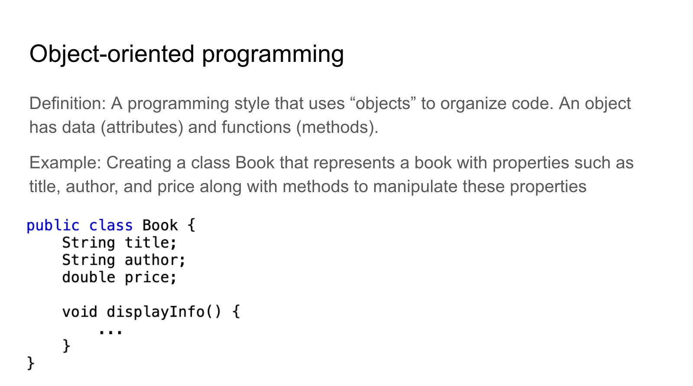

    

*Above is a sample of my presentation*

As an Assistant Teaching Assistant (ATA), my main responsibilities included assisting students during class hours and office hours. For my final project, I led two sessions of ICS 111 lab. I did a presentation on Object-oriented programming (OOP) and explained the homework of the week.

I enjoyed this project because I got to review OOP and teach it to others. It was rewarding to ask checkpoint questions (e.g., name the subclasses and superclasses on the Inheritance Example slide) and recieve responses from students, showing that they are following along. 

### Essential skills for the future
This experience helped me improve my leadership and public-speaking skills, which are valuable for my professional growth. 

[Here](https://www.canva.com/design/DAGdvvi9qq0/h9ytve19jVkOG1TNsWBhIg/edit?utm_content=DAGdvvi9qq0&utm_campaign=designshare&utm_medium=link2&utm_source=sharebutton) is a Canva link to my presentation.
